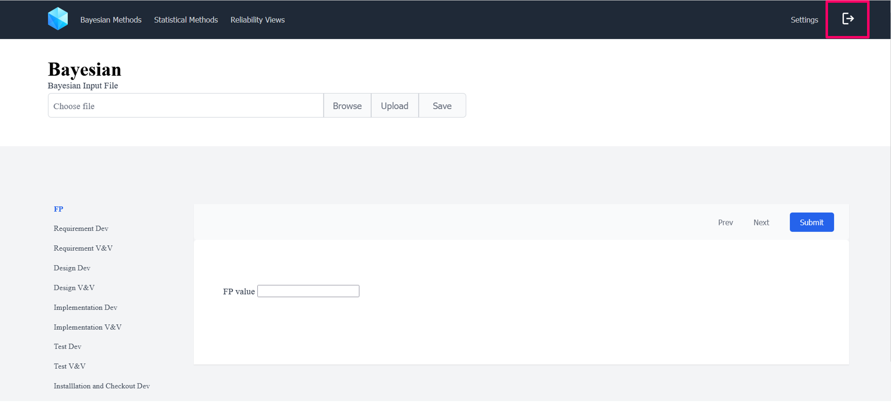
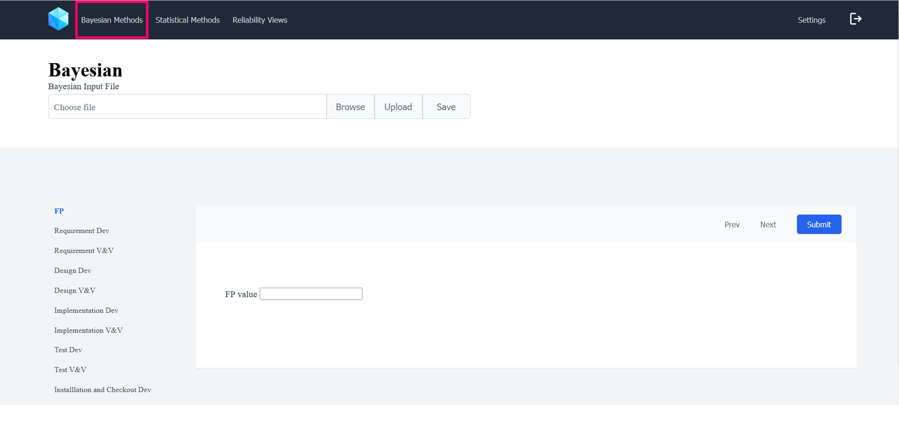
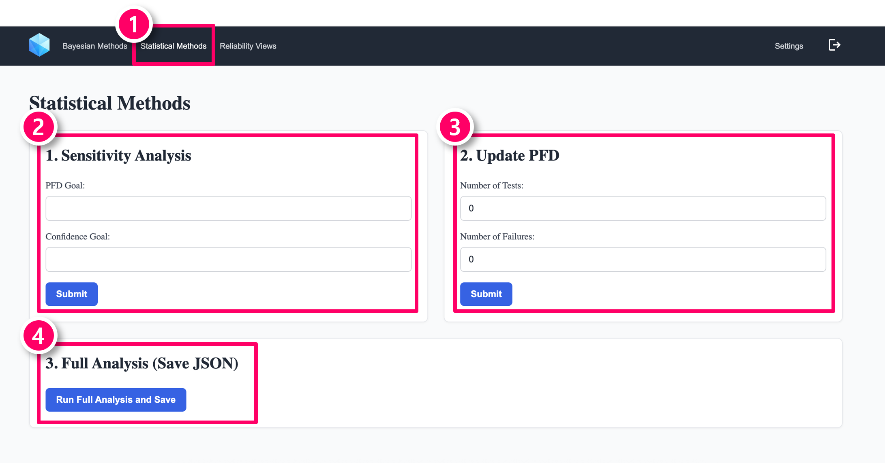
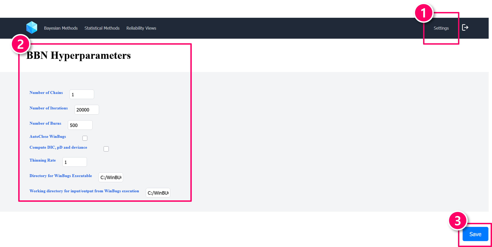
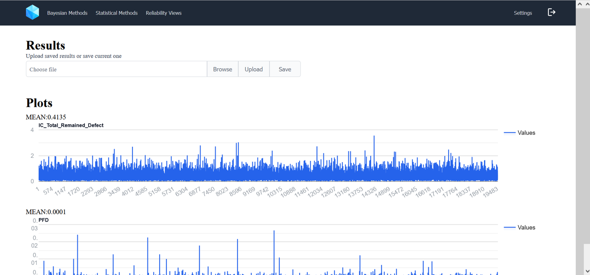

# 사용자 매뉴얼
PLCSoftRel은 베이지안 모델과 통계적 시험 기반의 PLC 소프트웨어 신뢰도 측정을 위한 웹 애플리케이션입니다.  
이 매뉴얼은 PLCSoftRel을 사용하여 PLC 소프트웨어의 신뢰도를 추정하는 방법을 설명합니다.

## 시작하기
1. [PLCSoftRel 계정 생성(회원가입)](#plcsoftrel-계정-생성회원가입)
2. [PLCSoftRel 로그인](#plcsoftrel-로그인)
3. [베이지안 기법용 활동 평가 결과 제출](#베이지안-기법용-활동-평가-결과-제출)
4. [통계적 기법용 시험 결과 제출](#통계적-기법용-시험-결과-제출)
5. [신뢰도 모델 파라미터 설정](#신뢰도-모델-파라미터-설정)
6. [신뢰도 결과 확인](#신뢰도-결과-확인)

## PLCSoftRel 계정 생성(회원가입)
**PLCSoftRel** 앱을 열고 우측 상단의 버튼을 클릭합니다.

로그인 화면이 나타나면, **Sign Up** 버튼을 클릭합니다.

회원가입 페이지로 이동하면 **이메일 주소**와 **비밀번호**를 입력한 후 **Sign Up** 버튼을 클릭하여 가입을 완료합니다.

## PLCSoftRel 로그인
**PLCSoftRel** 앱을 열고 우측 상단의 버튼을 클릭합니다.

로그인 화면으로 이동하면 **이메일 주소**와 **비밀번호**를 입력한 후 **Sign In** 버튼을 클릭하여 로그인합니다.

## 베이지안 기법용 활동 평가 결과 제출
**Bayesian Methods** 탭을 클릭하여 소프트웨어 관련 정보를 입력합니다.  
여기에는 **Function Point(FP) 수** 및 **개발 및 V&V 활동 평가 결과**가 포함됩니다.

### Function Point(FP) 수
Function Point(FP)는 소프트웨어의 크기와 복잡성을 나타내는 지표입니다.  
**미국 NRC 보고서 [1]**의 **표 8-10**을 참고하여 언어별 FP를 추정합니다.

1. **FP 수**를 입력합니다.
2. **Next** 버튼을 클릭하여 다음 단계로 이동합니다.

### 개발 및 V&V 활동 평가 결과
개발 및 V&V 활동 평가는 **미국 NRC 보고서 [1]**의 **섹션 4.2.1** 및 **부록 B**를 참고합니다.

> 활동 품질은 "High", "Medium", "Low" 3단계로 구분됩니다.

1. 드롭다운 목록에서 각 활동의 품질을 선택합니다.
2. **Prev** 및 **Next** 버튼으로 섹션 간 이동합니다.
3. 모든 데이터를 입력한 후 **Submit** 버튼을 클릭합니다.

## 통계적 기법용 시험 결과 제출
1. **Statistical Methods** 탭을 클릭합니다.
2. **수행한 테스트 수**와 **실패 횟수**를 입력합니다.
3. **Submit** 버튼을 클릭하면 신뢰도 추정 결과가 출력됩니다.
4. 추정된 신뢰도를 시각적으로 확인합니다.

## 신뢰도 모델 파라미터 설정
우측 상단의 **Settings** 아이콘을 클릭하여 신뢰도 모델 파라미터 설정 화면으로 이동합니다.

신뢰도 측정에 사용되는 **베이지안 모델** 및 **통계적 기법**의 파라미터를 설정할 수 있습니다.

### BBN (Bayesian Belief Network) 설정

다음 파라미터를 BBN 실행 전에 설정할 수 있습니다:

- **Number of Chains**: 병렬로 실행할 MCMC 체인의 수
- **Number of Iterations**: 전체 샘플링 반복 횟수
- **Burn-in**: 초기 버릴 반복 수 (편향 제거용)
- **Thinning Rate**: 샘플 수집 간격
- **DIC/pD 계산 여부**: DIC 및 유효 파라미터 수 계산 옵션

### 통계적 기법 설정

통계 기반 신뢰도 분석을 위한 설정입니다:

- **Prior PFD**: 사전 PFD(요구 시 실패 확률) 값
- **Confidence Level**: 신뢰도 계산에 사용할 신뢰 수준 (예: 95%)

### 설정 저장

파라미터 설정 후 **Save** 버튼을 클릭하면 이후 모든 분석에 적용됩니다.

> ⚠️ **주의**: 파라미터 변경은 결과에 영향을 줄 수 있으므로 신뢰성 보증 전략에 따라 신중히 설정하십시오.

## 신뢰도 결과 확인
결과를 제출하면 다음과 같은 신뢰도 지표의 **평균값** 및 **MCMC 시뮬레이션 추이**를 확인할 수 있습니다:

- **PFD (Probability of Failure on Demand)**: 요구 조건 만족 시 안전 소프트웨어가 작동하지 않을 확률  
  - 예: 원자로 보호 시스템에서 트립(trip) 신호가 발생해야 할 조건이 "요구"에 해당함

- **잔존 결함 수**

<!-- ## 계정
### 권한
- 검토자
- 사용자 -->

## 참고 문헌
1. Chu T.-L., Varuttamaseni A., Yue M., Lee S. J., Kang H. G., Cho J., & Yang S. (2018).  
   *Developing a Bayesian Belief Network Model for Quantifying the Probability of Software Failure of a Protection System (NUREG CR-7233)*. U.S. NRC.
